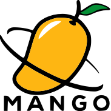

[](https://github.com/bitstep-ie/mango-go/actions/workflows/ci.yml)
[](https://github.com/bitstep-ie/mango-go/actions/workflows/codeql.yml)
[](https://github.com/bitstep-ie/mango-go/actions/workflows/dependabot/dependabot-updates)
[](https://codecov.io/github/bitstep-ie/mango-go)
[](https://goreportcard.com/report/github.com/bitstep-ie/mango-go)

<br />
<div align="center">
    <a href="https://github.com/bitstep-ie/mango-go">
    <picture>
        <source srcset="documentation/docs/assets/mango-with-text-black.png" media="(prefers-color-scheme: light)">
        <source srcset="documentation/docs/assets/mango-with-text-white.png" media="(prefers-color-scheme: dark)">
        
    </picture>
    </a>
    <h3 align="center">mango-go</h3>
    <p align="center">
        A collection of utility packages for go
        <br />
        <a href="https://bitstep-ie.github.io/mango-go/latest/"><strong>📚 Explore the docs »</strong></a>
        <br />
        <br />
        <a href="https://bitstep-ie.github.io/mango-go/latest/packages/env/">🔎 View Examples</a>
        &middot;
        <a href="https://github.com/bitstep-ie/mango-go/issues/new?labels=bug&template=bug-report---.md">
            🐛 Report Bug
        </a>
        &middot;
        <a href="https://github.com/bitstep-ie/mango-go/issues/new?labels=enhancement&template=feature-request---.md">
            💡 Request Feature
        </a>
    </p>
</div>
<br />
<!-- TABLE OF CONTENTS -->
<details>
  <summary>📂 Table of Contents</summary>
  <ol>
    <li>
        <a href="#about-the-project">📋 About The Project</a>
    </li>
    <li>
        <a href="#getting-started">🚀 Getting Started</a>
        <ul>
            <li><a href="#prerequisites">📘️ Prerequisites</a></li>
            <li><a href="#installation">🛠️ Installation</a></li>
            <li><a href="#packages">📦 Packages</a></li>
            <li><a href="#developer-guide">🧑‍💻 Developer Guide</a></li>
        </ul>
    </li>
    <li>
        <a href="#usage">👨‍💻 Usage</a>
    </li>
    <li>
        <a href="#contributing">📝 Contributing</a>
        <ul>
            <li><a href="#how-to-contribute">❓ How to Contribute</a></li>
            <li><a href="#getting-started-with-contributing">✨ Getting started with contributing</a></li>
        </ul>
    </li>
    <li>
        <a href="#license">📜 License</a>
    </li>
    <li>
        <a href="#acknowledgments">👏 Acknowledgments</a>
        <ul>
            <a href="#contributors">🤝 Contributors</a>
            <a href="#special-mentions">🙌 Special Mentions</a>
        </ul>
    </li>
  </ol>
</details>

## <a id="about-the-project"></a>📋 About the project

`mango-go` is a grab-bag of small, dependency-light utilities we found ourselves rewriting across services. Every package is:

- **Focused** – each folder solves a single problem (logging, env parsing, random data, etc.).
- **Drop-in** – import paths live under `github.com/bitstep-ie/mango-go/pkg/...`.
- **Well-documented** – every package ships with dedicated docs plus a [developer guide](documentation/docs/guide) full of copy-paste examples.
- **CI-backed** – linted, tested, and mutation-tested in CI so helpers stay reliable.

## <a id="getting-started"></a>🚀 Getting started

All you need to start using mango-go

### <a id="prerequisites"></a>📘️ Prerequisites

- **Go version**: mango-go requires [Go](https://go.dev/) version [1.24](https://go.dev/doc/devel/release#go1.24.0) or above
- **Basic Go knowledge**: Familiarity with Go syntax and package management is helpful

### <a id="installation"></a>🛠️ Installation

```bash
go get github.com/bitstep-ie/mango-go@latest
```

Modules are versioned, so you can pin a specific tag in `go.mod` if required.
With [Go's module support](https://go.dev/wiki/Modules#how-to-use-modules), simply import mango-go in your code and Go will automatically fetch it during build:

```go
import "github.com/bitstep-ie/mango-go"
```

### <a id="packages"></a>📦 Packages

| Package | What it does | Docs |
| --- | --- | --- |
| `env` | read env vars with defaults or panic-on-missing helpers | [docs](documentation/docs/packages/env.md) |
| `io` | delete/backup/restore files by extension for safe inline edits | [docs](documentation/docs/packages/io.md) |
| `logger` | opinionated slog handler with CLI/file/syslog outputs | [docs](documentation/docs/packages/logger) |
| `random` | math/crypto random helpers for fixtures, passwords, timestamps | [docs](documentation/docs/packages/random.md) |
| `slices` | generic slice utilities (contains, chunk, unique, etc.) | [docs](documentation/docs/packages/slices.md) |
| `testutils` | test helpers for temp files and UUID/token assertions | [docs](documentation/docs/packages/testutils.md) |
| `time` | start/end-of-day helpers, duration parsing, “time ago” strings | [docs](documentation/docs/packages/time.md) |

Looking for a tour that stitches these together?  
👉 [Developer Guide](documentation/docs/guide)

### 🔁 Quick start

```go
package main

import (
    "context"
    "log/slog"
    "time"
    mangoenv "github.com/bitstep-ie/mango-go/pkg/env"
    mangolog "github.com/bitstep-ie/mango-go/pkg/logger"
    mangotime "github.com/bitstep-ie/mango-go/pkg/time"
)

func main() {
    cfg := &mangolog.LogConfig{
        MangoConfig: &mangolog.MangoConfig{
            Strict: true,
            CorrelationId: &mangolog.CorrelationIdConfig{AutoGenerate: true},
        },
        Out: &mangolog.OutConfig{
            Enabled: true,
            Cli:   &mangolog.CliConfig{Enabled: true, Friendly: true, Verbose: true},
            File:  &mangolog.FileOutputConfig{Enabled: false},
        },
    }

    logger := slog.New(mangolog.NewMangoLogger(cfg))
    ctx := context.Background()
    ctx = context.WithValue(ctx, mangolog.APPLICATION, "billing-api")
    ctx = context.WithValue(ctx, mangolog.OPERATION, "invoice-create")
    ctx = context.WithValue(ctx, mangolog.TYPE, mangolog.BusinessType)

    timeout := mangoenv.EnvAsInt("HTTP_TIMEOUT", 15)
    deadline := mangotime.TimeAgo(mangotime.EndOfDay(time.Now()))

    logger.InfoContext(ctx, "ready to serve",
        slog.Int("timeoutSeconds", timeout),
        slog.String("deadline", deadline),
    )
}
```

Run the snippet to see CLI-friendly output plus structured JSON (when file logging is enabled).

### <a id="developer-guide"></a>🧑‍💻 Developer Guide

Looking for end-to-end examples that combine logging, environment loading, random data generation, time helpers, and more?  
👉 Jump into [documentation/docs/guide.md](documentation/docs/guide).

## <a id="usage"></a>👨‍💻 Usage

The packages are intentionally orthogonal, so feel free to mix and match:

```go
import (
    "log/slog"
    "time"
    mangorand "github.com/bitstep-ie/mango-go/pkg/random"
    mangoslices "github.com/bitstep-ie/mango-go/pkg/slices"
    mangotime "github.com/bitstep-ie/mango-go/pkg/time"
)

func demo() {
    orders := []int{1, 2, 2, 3}
    if mangoslices.EqualsIgnoreOrder(orders, []int{3, 2, 2, 1}) {
        token := mangorand.Password(20, mangorand.PasswordOptions{Letters: true, Digits: true})
        start := mangotime.StartOfDay(time.Now())
        end := mangotime.EndOfDay(time.Now())

        slog.Info("processing window",
            slog.String("token", token),
            slog.String("start", start.Format(time.RFC3339)),
            slog.String("end", end.Format(time.RFC3339)),
        )
    }
}
```

Check each package doc (table above) for deeper walkthroughs and additional helpers.

## <a id="contributing"></a>📝 Contributing

We welcome and appreciate your contributions!

### <a id="how-to-contribute"></a>❓ How to Contribute

- 🐛 Report bugs - Help us identify and fix issues
- 💡 Suggest features - Share your ideas for improvements
- 📝 Improve documentation - Help make our docs clearer
- 🔧 Submit code - Fix bugs or implement new features
- 🧪 Write tests - Improve our test coverage

### <a id="getting-started-with-contributing"></a>✨ Getting started with contributing

- Check out our [contributing.md](CONTRIBUTING) for detailed guidelines
- Join our community discussions and ask questions

**All contributions are valued and help make mango better for everyone!**

## <a id="license"></a>📜 License


## <a id="acknowledgments"></a>👏 Acknowledgments

### <a id="contributors"></a>🤝 Contributors

 <a href = "https://github.com/bitstep-ie/mango-go/graphs/contributors">
   
 </a>

### <a id="special-mentions"></a>🙌 Special Mentions

<table align="center">
  <tr>
    <td align="center"><a href="https://github.com/Ronan-L-OByrne"><br /><sub><b>Ronan</b></sub></a></td>
    <td align="center"><a href="https://github.com/bencarroll1"><br /><sub><b>Ben</b></sub></a></td>
  </tr>
</table>
